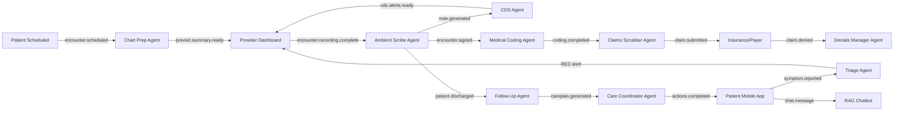

<div align="center">

# 🛡️ Aegis AI

### *Intelligent Healthcare Platform Powered by Multi-Agent AI Systems*

[](https://nextjs.org/)
[](https://www.typescriptlang.org/)
[](https://www.bahmni.org/)
[](https://ai.google.dev/)
[](https://github.com/langchain-ai/langgraph)
[](LICENSE)

**Aegis AI** is a production-grade, multi-agent healthcare platform that transforms the clinical workflow by eliminating manual administrative burden on doctors, patients, hospital staff, and insurance interfaces. Built on top of **Bahmni EMR** and powered by **11 specialized AI agents** orchestrated through **LangGraph**, Aegis AI automates the entire lifecycle — from pre-visit chart preparation to post-discharge patient recovery.

[🚀 Getting Started](#-getting-started) · [🧬 Agent Architecture](#-the-11-agent-ecosystem) · [📊 Social Impact](#-social-impact--why-it-matters) · [🏗️ Tech Stack](#%EF%B8%8F-technology-stack) · [📖 Research Foundation](#-research-foundation)

</div>

---

## 📋 Table of Contents

- [The Problem We're Solving](#-the-problem-were-solving)
- [What is Aegis AI?](#-what-is-aegis-ai)
- [The 11-Agent Ecosystem](#-the-11-agent-ecosystem)
- [Social Impact & Why It Matters](#-social-impact--why-it-matters)
- [Key Features](#-key-features)
- [Technology Stack](#%EF%B8%8F-technology-stack)
- [Architecture Overview](#-architecture-overview)
- [Getting Started](#-getting-started)
- [API Strategy & Bahmni Integration](#-api-strategy--bahmni-integration)
- [Research Foundation](#-research-foundation)
- [Design Philosophy](#-design-philosophy)
- [Roadmap](#-roadmap)
- [Contributing](#-contributing)
- [License](#-license)

---

## 🩺 The Problem We're Solving

Healthcare systems worldwide are drowning in **administrative overhead**, **data fragmentation**, and **manual processes** that steal time from patient care:

### The Doctor's Crisis

| Problem | Impact |
|:--------|:-------|
| **35% of a physician's day** is spent on documentation, not patients | Physicians see fewer patients, experience burnout |
| **15–20 minutes per patient** manually reviewing scattered EHR records | Delayed care, missed critical history |
| **8–15 minutes per encounter** manually coding ICD-10/CPT for billing | Revenue leakage, coding errors, claim denials |
| **$25–$30 per denied claim** to rework and resubmit | Hospitals lose millions annually |

### The Patient's Crisis

| Problem | Impact |
|:--------|:-------|
| **Discharge instructions** given verbally to stressed patients | Patients forget > 80% within 24 hours |
| **No systematic post-discharge follow-up** beyond a single phone call | 20% readmission rate within 30 days |
| **Phone-hold triage** with nurses who lack chart context | Dangerous deterioration goes undetected |
| **Insurance verification delays** (15–20 minute phone calls per patient) | Delayed treatment, surprise bills |

### The System's Crisis

| Problem | Impact |
|:--------|:-------|
| **Manual prior authorization** processes (4-page forms, fax-based) | 2–5 business day delays for critical procedures |
| **5–10% claim denial rate** industry-wide | Billions in lost hospital revenue |
| **Fragmented health records** across hospitals, exchanges, ABDM | Incomplete patient picture for providers |
| **Care coordination failures** at discharge | Referrals lost, prescriptions unfilled |

> **Aegis AI exists to solve all of these problems simultaneously — with a single, intelligent platform.**

---

## 🧠 What is Aegis AI?

Aegis AI is a **multi-agent orchestration platform** where 11 specialized AI agents work in concert across four operational phases that mirror the natural clinical encounter flow:

```
     Pre-Encounter          Point-of-Care         Revenue Cycle        Post-Discharge
     ─────────────          ──────────────         ─────────────        ──────────────
  ┌─────────────────┐   ┌─────────────────┐   ┌─────────────────┐   ┌─────────────────┐
  │ Chart Prep      │   │ Ambient Scribe  │   │ Medical Coding  │   │ Follow-Up &     │
  │ Insurance Auth  │──▶│ Clinical CDS    │──▶│ Claims Scrubber │──▶│ Care Plan       │
  │                 │   │                 │   │ Denials Manager │   │ Care Coordinator│
  │                 │   │                 │   │                 │   │ Triage Agent    │
  │                 │   │                 │   │                 │   │ RAG Chatbot     │
  └─────────────────┘   └─────────────────┘   └─────────────────┘   └─────────────────┘
```

Each agent is a **stateful LangGraph node** that:
- Consumes events from a **Redis Streams** event bus
- Processes data with **Google Gemini 2.0 Flash**
- Emits structured outputs to downstream agents
- Maintains a **human-in-the-loop** — agents suggest, they never unilaterally act on clinical decisions

---

## 🧬 The 11-Agent Ecosystem

### Phase 1: Pre-Encounter & Access

#### 1️⃣ Chart Prep Agent (`agent.chart_prep`)
**Eliminates 15–20 minutes of manual chart-digging per patient**

- Fetches patient history from PostgreSQL, ABDM HIE (FHIR R4), and simulation FHIR servers
- Produces a clinically actionable **Pre-Visit Summary** with active problems, current medications, abnormal labs, allergies, and flags
- Latency: < 45 seconds
- Output confidence scoring based on data freshness and completeness

#### 2️⃣ Insurance & Prior Authorization Agent (`agent.insurance_auth`)
**Replaces 20-minute phone calls to insurance companies**

- **OCR Stage**: Gemini 2.0 Flash Vision extracts Member ID, Group Number, Plan Name from insurance card photos
- **Eligibility Check**: Sends EDI 270 requests, parses 271 responses
- **Prior Auth Draft**: Auto-generates authorization request letters citing clinical justification
- Latency: < 2 minutes (eligibility), < 10 minutes (prior auth draft)

---

### Phase 2: Point-of-Care

#### 3️⃣ Ambient Scribe Agent (`agent.ambient_scribe`)
**Eliminates 10–15 minutes of post-visit typing per patient**

- Converts diarized audio transcripts into fully structured **SOAP notes**
- Extracts clinical entities: symptoms, diagnoses (ICD-10), medications, lab orders
- EHR-ready output with automatic ICD-10 code mapping
- Latency: < 30 seconds post-recording
- Replaces the 35% of a physician's day spent on documentation

#### 4️⃣ Clinical Decision Support Agent (`agent.cds`)
**Real-time safety net that catches drug interactions and guideline gaps**

- Cross-references new prescriptions against active medications via **RxNorm API**
- Checks patient allergy list for contraindications
- Surfaces preventive screening reminders (USPSTF guidelines)
- Drug-drug interaction severity classification (WARNING / INFO)
- Latency: < 10 seconds

---

### Phase 3: Revenue Cycle Management

#### 5️⃣ Medical Coding Agent (`agent.medical_coder`)
**Replaces 8–15 minutes of manual ICD-10/CPT coding per encounter**

- Maps diagnosed conditions to ICD-10-CM codes (primary + secondary)
- Determines E/M level (CPT 99202–99215) using AMA 2021 MDM guidelines
- Appends appropriate modifiers (-25, -59)
- Cross-checks NCCI edits to prevent bundling errors
- Confidence scoring per code assignment

#### 6️⃣ Claims Scrubbing & Generation Agent (`agent.claims_scrubber`)
**Catches billing errors BEFORE they become costly denials**

- Rules-based validation of all EDI 837P required fields
- Medical necessity cross-check (diagnosis ↔ procedure)
- **LLM anomaly detection**: Gemini reviews claims holistically for semantic inconsistencies
- Generates ASC X12 EDI 837P transaction sets
- Latency: < 30 seconds

#### 7️⃣ Denials Management Agent (`agent.denials_manager`)
**Automates the 45–60 minute manual appeal process for rejected claims**

- Decodes CARC/RARC codes from remittance advice (ERA)
- **RAG pipeline**: Retrieves patient chart, SOAP note, and payer-specific appeal policies from Pinecone
- Auto-generates formal appeal letters with clinical attachments
- Tracks appeal deadlines and confidence of overturn
- Latency: < 5 minutes per appeal draft

---

### Phase 4: Post-Discharge & Patient Engagement

#### 8️⃣ Follow-Up & Care Plan Agent (`agent.follow_up`)
**Translates dense discharge summaries into 7-day mobile-ready care plans**

- Day-by-day medication schedules, symptom surveys, wound photo uploads, activity logs
- Configurable triage thresholds (pain levels, temperature, blood pressure)
- Daily check-in orchestration loop during 7-day recovery window
- Replaces the printed discharge sheet patients rarely read

#### 9️⃣ Care Coordination Agent (`agent.care_coordinator`)
**Automates post-discharge logistics that take hours of manual phone calls**

- Sends e-prescriptions to preferred pharmacies
- Schedules follow-up appointments automatically
- Sends specialist referral packets with supporting documentation
- Notifies patients via app / WhatsApp / SMS
- Latency: < 3 minutes for all external actions

#### 🔟 Triage & Escalation Agent (`agent.triage`)
**Replaces the phone-triage nurse with continuous AI monitoring**

- Evaluates daily check-in data against clinical thresholds
- Free-text symptom analysis for "red flag" keywords
- **Three-tier classification**: GREEN (no action) → AMBER (nurse review) → RED (immediate escalation)
- WebSocket alert to Provider Dashboard + SMS fallback if unacknowledged after 15 minutes
- Latency: < 5 seconds

#### 1️⃣1️⃣ Post-Discharge RAG Chatbot (`agent.rag_chatbot`)
**24/7 patient Q&A powered by their actual discharge documents**

- Discharge summary embedded via Gemini Embedding API (768-dim vectors) → stored in Pinecone
- Similarity search retrieves top-3 relevant chunks per patient query
- Gemini answers strictly from retrieved context
- Recommends contacting the doctor when uncertain
- Latency: < 3 seconds per response

---

## 🌍 Social Impact & Why It Matters

### Healthcare is Broken — AI Agents Can Fix It

The healthcare industry is facing a **triple crisis**: physician burnout, patient safety gaps, and administrative waste. Aegis AI directly addresses each dimension:

#### 🏥 For Hospitals & Health Systems

| Metric | Current State | With Aegis AI |
|:-------|:-------------|:--------------|
| Physician documentation time | 35% of clinical day | **< 5%** (ambient scribe) |
| Chart prep time per patient | 15–20 minutes | **< 45 seconds** (automated) |
| Claim denial rate | 5–10% | **< 2%** (pre-submission scrubbing) |
| Appeal turnaround | 2–3 hours per claim | **< 5 minutes** (AI-generated) |
| Prior auth submission | 60+ minutes manual | **< 10 minutes** (AI-drafted) |
| Post-discharge follow-up | 1 phone call (maybe) | **7-day automated care plan** |

#### 👨‍⚕️ For Doctors

- **Reclaim their day**: Doctors practice medicine instead of typing notes
- **Safety net**: Real-time drug interaction and allergy alerts they'd otherwise miss under time pressure
- **Pre-visit intelligence**: Walk into every appointment fully briefed
- **Burnout reduction**: The #1 driver of physician burnout is documentation — Aegis eliminates it

#### 👩‍👧 For Patients

- **Better care**: Doctors who aren't distracted by paperwork provide better care
- **Post-discharge safety**: 7-day AI-monitored recovery with immediate escalation if something goes wrong
- **24/7 answers**: Ask "Can I shower after surgery?" at 2 AM and get an answer grounded in YOUR discharge documents
- **Financial transparency**: Insurance verification before you walk in, not a surprise bill weeks later

#### 🌍 For India & Developing Nations

- **ABDM Integration**: Native support for India's Ayushman Bharat Digital Mission (ABHA IDs, FHIR R4)
- **Rural healthcare**: AI agents can extend specialist-level decision support to rural primary care centers
- **Scalability**: One Aegis deployment can serve an entire hospital network — the AI agents scale linearly
- **Hindi & multilingual support**: Patient-facing chatbot designed for India's linguistic diversity

#### 📊 The Numbers That Matter

> - **250,000+** physicians report burnout annually in India alone
> - **$262 billion** is wasted on administrative complexity in US healthcare annually
> - **20%** of discharged patients are readmitted within 30 days — most preventably
> - **Medical errors** are the 3rd leading cause of death in developed nations

**Every manual process Aegis AI automates is a potential patient safety failure it prevents.**

---

## ✨ Key Features

### 🎨 Premium Glassmorphic UI
- **DNA-helix animated background** across all pages
- **Glassmorphism design system** with translucent panels, blur effects, and vibrant gradients
- **Dark mode optimized** with carefully curated HSL color palettes
- **Responsive design** that works on desktop, tablet, and mobile
- **Micro-animations** on all interactive elements

### 📸 Patient Registration & Photo Management
- **WebRTC camera integration** for patient photo capture
- **Photo persistence** via Bahmni's `patientprofile` API endpoint
- **Registration card download** with clean print layouts
- **HIPAA-compliant** photo encryption at rest

### 🔐 Authentication & Session Management
- **Basic Auth integration** with Bahmni/OpenMRS backend
- **Persistent sessions** via `js-cookie` — no re-login on reload
- **Auth-aware routing** with automatic redirect

### 🖥️ Clinical Dashboard
- **Patient search** with real-time results and photo thumbnails
- **Inline patient editing** for demographics, contacts, and identifiers
- **Visit management** — start OPD visits, enter visit details
- **Provider dashboard** with agent-generated alerts and summaries
- **Ward map** for bed management and patient tracking

### 📊 Clinical Modules
- **Timeline** — chronological patient encounter history
- **Vitals** — recording and trending vital signs
- **Medications** — prescription management with drug interaction alerts
- **Prescriptions** — digital prescription generation
- **Lab Results** — lab order tracking and result visualization
- **Routine Panel** — configurable lab panels
- **Billing** — revenue cycle tracking and claims status

---

## 🏗️ Technology Stack

### Frontend
| Technology | Purpose |
|:-----------|:--------|
| **Next.js 15** | React framework with App Router, Server Components |
| **TypeScript 5** | Type-safe development |
| **Tailwind CSS v4** | Utility-first styling with custom design tokens |
| **WebRTC** | Browser-based camera capture for patient photos |
| **js-cookie** | Session persistence and auth credential management |

### Backend & Infrastructure
| Technology | Purpose |
|:-----------|:--------|
| **Bahmni EMR** | Open-source hospital management system (Docker deployment) |
| **OpenMRS** | Core medical record system with REST API |
| **PostgreSQL** | Primary database for patient records and clinical data |
| **Redis Streams** | Event bus for inter-agent communication |
| **Docker** | Containerized deployment for all services |

### AI & ML Stack
| Technology | Purpose |
|:-----------|:--------|
| **Google Gemini 2.0 Flash** | Core LLM for all 11 agents (structured output mode) |
| **LangGraph** | Multi-agent orchestration and state management |
| **Pinecone** | Vector database for RAG (discharge documents, payer policies) |
| **Gemini Embedding API** | 768-dimensional vector embeddings for document retrieval |
| **RxNorm API** | Drug interaction and allergy cross-referencing |

### Healthcare Standards
| Standard | Usage |
|:---------|:------|
| **HL7 FHIR R4** | Interoperability with Health Information Exchanges |
| **ABDM (ABHA)** | India's Ayushman Bharat Digital Mission integration |
| **ICD-10-CM** | Diagnosis coding (auto-assigned by Medical Coding Agent) |
| **CPT** | Procedure coding with modifier support |
| **EDI 837P / 835** | Claims submission and remittance advice processing |
| **ASC X12** | Electronic data interchange for insurance transactions |

---

## 🏛️ Architecture Overview

```
┌─────────────────────────────────────────────────────────────────────────────────┐
│                              AEGIS AI PLATFORM                                  │
│                                                                                 │
│  ┌─────────────────────────────────────────────────────────────────────────┐    │
│  │                        FRONTEND (Next.js 15)                            │    │
│  │   Glassmorphic UI · Patient Registration · Clinical Dashboard           │    │
│  │   WebRTC Camera · Registration Cards · Provider Alerts                  │    │
│  └────────────────────────────┬────────────────────────────────────────────┘    │
│                               │ REST API                                        │
│  ┌────────────────────────────▼────────────────────────────────────────────┐    │
│  │                     BAHMNI EMR (Docker)                                  │    │
│  │   OpenMRS Core · Patient Profile API · Visit Management                 │    │
│  │   PostgreSQL · FHIR R4 Server · ABDM Integration                        │    │
│  └────────────────────────────┬────────────────────────────────────────────┘    │
│                               │ Events (Redis Streams)                          │
│  ┌────────────────────────────▼────────────────────────────────────────────┐    │
│  │                   AI AGENT LAYER (LangGraph)                             │    │
│  │                                                                          │    │
│  │   Phase 1          Phase 2          Phase 3           Phase 4            │    │
│  │   ┌──────────┐    ┌──────────┐    ┌──────────┐     ┌──────────┐         │    │
│  │   │Chart Prep│    │ Ambient  │    │ Medical  │     │Follow-Up │         │    │
│  │   │          │    │ Scribe   │    │ Coder    │     │Care Plan │         │    │
│  │   │Insurance │    │          │    │          │     │          │         │    │
│  │   │Auth      │    │ CDS      │    │ Claims   │     │Care Coord│         │    │
│  │   │          │    │          │    │ Scrubber │     │          │         │    │
│  │   │          │    │          │    │          │     │ Triage   │         │    │
│  │   │          │    │          │    │ Denials  │     │          │         │    │
│  │   │          │    │          │    │ Manager  │     │RAG Chat  │         │    │
│  │   └──────────┘    └──────────┘    └──────────┘     └──────────┘         │    │
│  │                                                                          │    │
│  │   Shared State: OmniCareState (LangGraph TypedDict)                      │    │
│  │   Model: Gemini 2.0 Flash · Vector DB: Pinecone · Drug API: RxNorm       │    │
│  └──────────────────────────────────────────────────────────────────────────┘    │
│                                                                                 │
└─────────────────────────────────────────────────────────────────────────────────┘
```

### Agent Communication & Event Flow



---

## 🚀 Getting Started

### Prerequisites

- **Node.js 18+** and **npm 9+**
- **Docker** and **Docker Compose** (for Bahmni backend)
- **Git**

### 1. Clone the Repository

```bash
git clone https://github.com/veeralsaxena/Aegis-AI.git
cd Aegis-AI
```

### 2. Start the Bahmni Backend

```bash
cd bahmni-docker
docker compose up -d
```

Wait for all services to be healthy (PostgreSQL, OpenMRS, Bahmni Web):

```bash
docker compose ps
```

### 3. Start the Frontend

```bash
cd omnicare-frontend
npm install
npm run dev
```

The application will be available at **https://localhost:3000**

### 4. Login

```
Username: superman
Password: Admin123
```

### Environment Variables

Create a `.env.local` file in the `omnicare-frontend/` directory:

```env
NEXT_PUBLIC_BACKEND_URL=https://localhost
NEXT_PUBLIC_GEMINI_API_KEY=your_gemini_api_key
```

---

## 🔌 API Strategy & Bahmni Integration

Aegis AI is built as a **Bahmni-native application**, using the same APIs that the native Bahmni EMR UI uses:

### Patient Registration & Management
| Operation | API Endpoint |
|:----------|:-------------|
| Create Patient | `POST /openmrs/ws/rest/v1/bahmnicore/patientprofile` |
| Update Patient | `POST /openmrs/ws/rest/v1/bahmnicore/patientprofile/{uuid}` |
| Upload Photo | `POST /openmrs/ws/rest/v1/bahmnicore/patientprofile/{uuid}` (with `image` field) |
| Fetch Photo | `GET /openmrs/ws/rest/v1/patientImage?patientUuid={uuid}` |
| Search Patients | `GET /openmrs/ws/rest/v1/bahmnicore/search/patient/lucene?q={query}` |

### Visit & Encounter Management
| Operation | API Endpoint |
|:----------|:-------------|
| Start Visit | `POST /openmrs/ws/rest/v1/visit` |
| Get Visit Details | `GET /openmrs/ws/rest/v1/visit?patient={uuid}` |
| Create Encounter | `POST /openmrs/ws/rest/v1/bahmnicore/bahmniencounter` |

### Why Bahmni APIs Over Raw OpenMRS?

Bahmni's `patientprofile` API provides **atomic operations** that handle multiple concerns in a single request:
- Patient demographics update
- Person attributes
- Photo upload (base64)
- Identifier management

The raw OpenMRS REST API requires multiple separate calls for the same operation, increasing failure points and complexity.

---

## 📖 Research Foundation

Aegis AI's architecture is grounded in **400+ peer-reviewed research papers** on agentic AI in healthcare, published in top venues including:

- **Nature Medicine**, **Nature Machine Intelligence**, **Nature Biomedical Engineering**
- **NeurIPS** (including Oral presentations), **ICLR**, **ICML**, **ACL**, **EMNLP**
- **The Lancet Digital Health**, **npj Digital Medicine**, **Cell Reports Medicine**
- **MICCAI**, **AAAI**, **NAACL**, **COLING**

Our research catalog — covering doctor-facing agents, patient-facing applications, drug discovery, healthcare administration, and benchmarks — is documented in [`AGENTS_IN_AEGIS.md`](./AGENTS_IN_AEGIS.md).

### Key Validating Research

| Our Agent | Research Validation |
|:----------|:-------------------|
| **Ambient Scribe** | SOAP note generation from clinical dialogues (multiple NeurIPS/EMNLP papers) |
| **CDS Agent** | Drug interaction detection via multi-agent reasoning (Nature Communications, RxNorm) |
| **Medical Coder** | ICD-10/CPT auto-coding with LLM agents (MedDCR, Code Like Humans) |
| **Denials Manager** | RAG-based claim appeal generation (Agentic RAG systems) |
| **RAG Chatbot** | Patient-facing conversational agents (JAMIA Open, Conversational Health Agents) |
| **Triage Agent** | Automated patient triage with LLMs (CLARITY, TriageAgent) |
| **Care Coordinator** | Function-calling agents for clinical workflows (TxAgent, ReflecTool) |

---

## 🎨 Design Philosophy

### Glassmorphic Healthcare UI

Aegis AI breaks from the sterile, clinical look of traditional EMR systems with a **premium, modern design language**:

- **DNA-helix animated background** — symbolizing the intersection of biology and technology
- **Glassmorphism panels** — translucent, blurred backgrounds that create depth
- **Vibrant gradient accents** — moving beyond the dull grays of legacy systems
- **Inter typeface** — clean, medical, professional
- **Dark mode first** — reduces eye strain during long clinical shifts
- **Print-optimized layouts** — registration cards print cleanly with white backgrounds

### Accessibility Principles
- High contrast ratios for text readability
- Keyboard-navigable interface
- Screen reader compatible semantic HTML
- Responsive layouts for tablet use at bedside

---

## 🗺️ Roadmap

### ✅ Completed (v1.0)
- [x] Patient registration with Bahmni `patientprofile` API
- [x] WebRTC patient photo capture and persistence
- [x] Patient search with photo thumbnails
- [x] Inline patient editing (active + inactive patients)
- [x] Registration card download with print-optimized CSS
- [x] Session persistence (no re-login on reload)
- [x] Glassmorphic design system
- [x] Visit management (Start OPD Visit, Enter Visit Details)

### 🔄 In Progress (v1.1)
- [ ] Ambient Scribe integration (Gemini 2.0 Flash structured output)
- [ ] Clinical Decision Support alerts in Provider Dashboard
- [ ] ABDM ABHA ID verification
- [ ] Audit logging for Bahmni compliance

### 🛣️ Planned (v2.0)
- [ ] Full LangGraph agent orchestration with Redis Streams
- [ ] Medical Coding Agent (ICD-10/CPT auto-assignment)
- [ ] Claims Scrubbing & EDI 837P generation
- [ ] Denials Management with RAG appeal drafting
- [ ] Post-Discharge Care Plan generation
- [ ] Patient-facing RAG Chatbot (mobile-ready)
- [ ] Triage & Escalation with WebSocket real-time alerts
- [ ] Care Coordination with pharmacy/appointment integrations
- [ ] Hindi language support for patient chatbot

---

## 🤝 Contributing

We welcome contributions! Aegis AI is built for the healthcare community, by the healthcare community.

1. Fork the repository
2. Create your feature branch (`git checkout -b feature/amazing-agent`)
3. Commit your changes (`git commit -m 'Add CDS drug interaction agent'`)
4. Push to the branch (`git push origin feature/amazing-agent`)
5. Open a Pull Request

### Development Guidelines
- Follow the existing TypeScript conventions
- Use Bahmni `patientprofile` API over raw OpenMRS endpoints
- All new agents must include human-in-the-loop review
- Write JSDoc comments for all public functions
- Test on both active and non-active patient scenarios

---

## 📄 License

This project is licensed under the MIT License — see the [LICENSE](LICENSE) file for details.

---

## 🙏 Acknowledgments

- **[Bahmni](https://www.bahmni.org/)** — Open-source EMR platform powering our backend
- **[OpenMRS](https://openmrs.org/)** — Medical record system at the core
- **[Google Gemini](https://ai.google.dev/)** — LLM powering all 11 AI agents
- **[LangGraph](https://github.com/langchain-ai/langgraph)** — Multi-agent orchestration framework
- **400+ research papers** documented in our [Research Foundation](./AGENTS_IN_AEGIS.md)

---

<div align="center">

**Built with ❤️ for healthcare by the Aegis AI Team**

*Because every minute a doctor spends on paperwork is a minute not spent saving lives.*

[](https://github.com/veeralsaxena/Aegis-AI)

</div>
