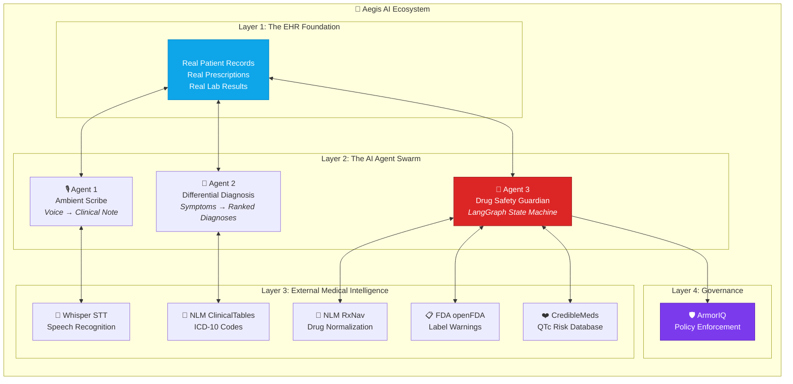
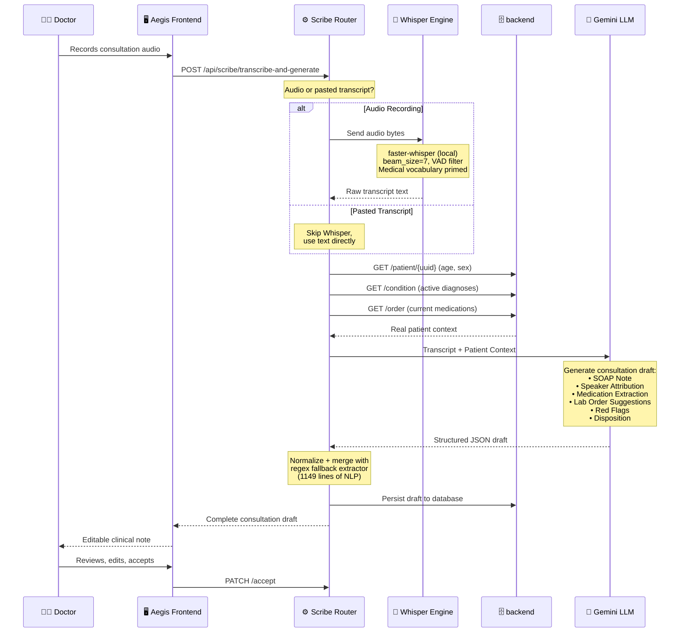
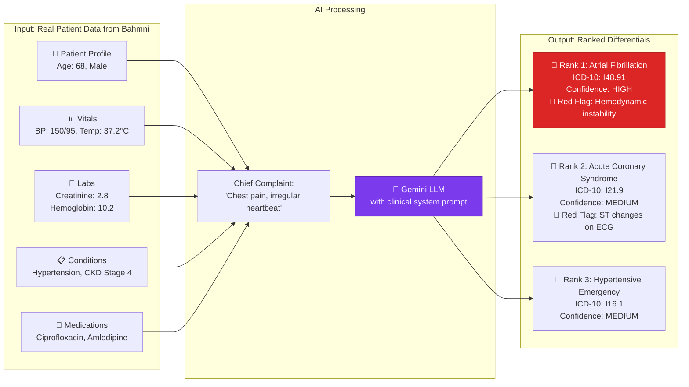
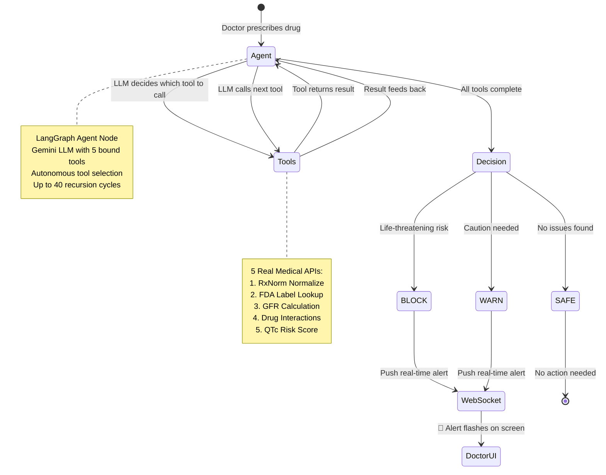
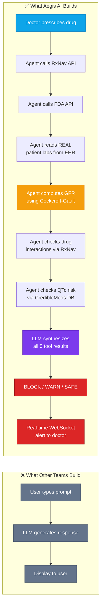
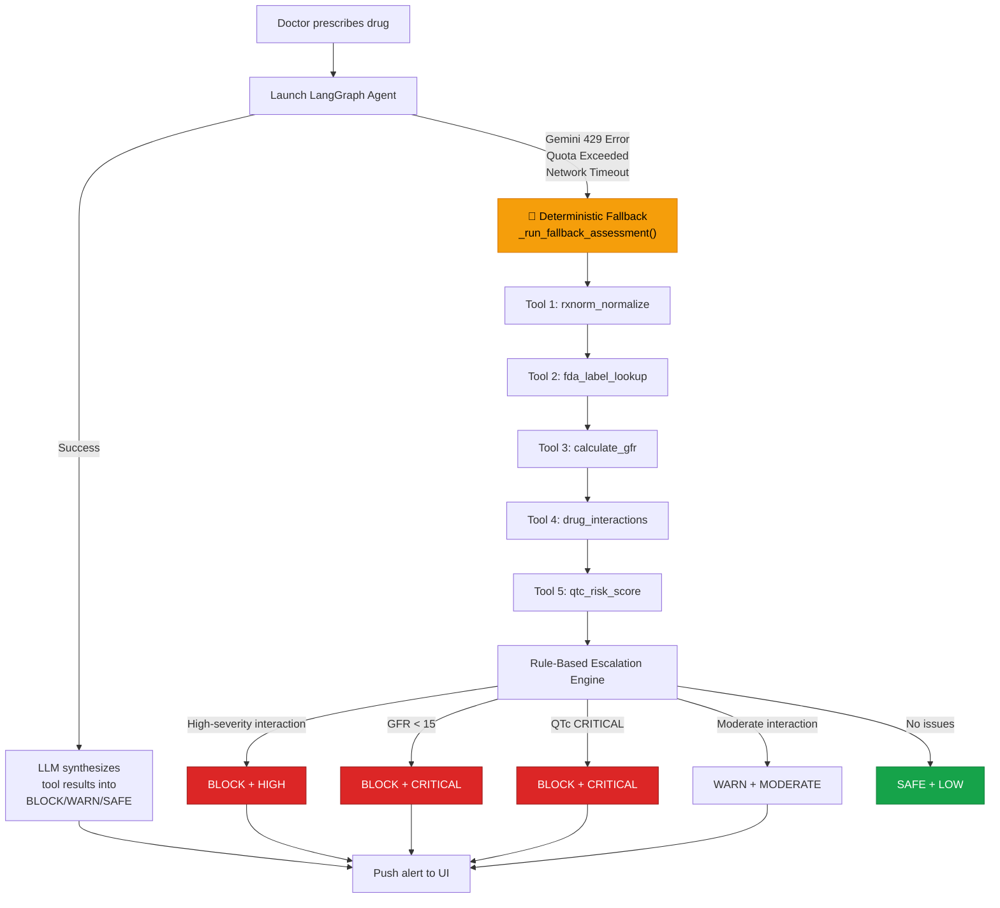
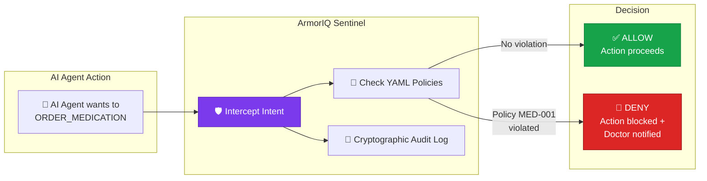
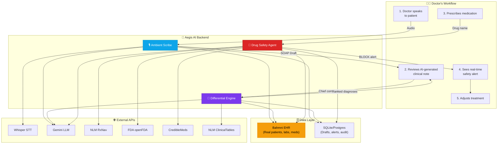

# 🛡️ Aegis AI - The Intelligent EHR

> **"Every team has AI agents. Ours save lives."**

---

## The Problem: A Doctor's Nightmare

It's 2:00 AM. Dr. Priya is on hour 14 of her shift in a busy Mumbai hospital. She has seen 47 patients today. She is exhausted.

Mr. Sharma, 68 years old, walks in with chest pain and an irregular heartbeat. Dr. Priya quickly examines him and reaches for the prescription pad. The standard treatment: **Amiodarone** for the arrhythmia.

What Dr. Priya doesn't remember at 2 AM — buried 3 pages deep in Mr. Sharma's chart — is that he is already on **Ciprofloxacin** for a urinary infection, his **potassium is 3.1 mEq/L** (dangerously low), and his **creatinine is 2.8 mg/dL** (Stage 4 kidney disease).

If that Amiodarone prescription goes through:
- **Ciprofloxacin + Amiodarone** = Critical QTc prolongation → Cardiac arrest risk
- **GFR of 22 mL/min** = The drug cannot be cleared by his kidneys
- **Hypokalemia** = Amplifies the cardiac toxicity by 2x

> [!CAUTION]
> **In a traditional EHR, this prescription goes through with zero warnings. Mr. Sharma's life depends entirely on a fatigued doctor's memory.**

**Aegis AI exists so this never happens.**

---

## The Solution: Three AI Agents, One Mission

Aegis AI is not a chatbot bolted onto a medical record. It is a **coordinated swarm of autonomous AI agents** deeply embedded inside a real, working Electronic Health Record (Bahmni/OpenMRS).

---

## Agent 1: The Ambient Scribe 🎙️

> *The doctor talks. The AI documents.*

### What It Does
The doctor walks into the room, sits down, and simply **talks to the patient**. No keyboard. No clicking. No drop-down menus. In the background, Aegis AI captures every word.

### How It Actually Works

### The Secret Sauce: Hybrid NLP
Most scribe systems send audio to an LLM and return whatever it says. **Aegis AI runs a 1,149-line deterministic NLP pipeline in parallel:**

| Feature | LLM-Only Approach | Aegis AI Hybrid |
|---|---|---|
| Drug name extraction | Hopes the LLM catches it | Regex matches drug suffixes (`-mycin`, `-cillin`, `-pril`, `-sartan`) |
| Hindi-English mixing | Often garbled | Dedicated transliteration normalization layer |
| Whisper misheards | "has been you" stays wrong | Auto-corrects to "has dengue" via medical vocabulary map |
| LLM quota exceeded | **System crashes** | Deterministic fallback generates full draft from transcript alone |

> [!IMPORTANT]
> **If Gemini goes down, the Scribe still works.** The fallback extracts SOAP sections, medications, labs, and diagnoses entirely from regex and heuristic analysis.

---

## Agent 2: Differential Diagnosis Engine 🧠

> *An invisible second opinion for every doctor, every visit.*

### What It Does
Given a chief complaint and a patient, it generates **3-5 ranked differential diagnoses** with reasoning, red flags, and recommended investigations — grounded in the patient's actual EHR data.

### How It Actually Works

### ICD-10 Validation
Every diagnosis suggestion is cross-referenced against the **NLM ClinicalTables API** to attach a validated ICD-10 code — not a hallucinated one.

---

## Agent 3: The Drug Safety Guardian 💊

### What It Does
The moment a doctor prescribes a drug, this agent **autonomously launches a 5-step pharmacological safety investigation** using real medical databases and real patient data. It can **BLOCK** a dangerous prescription before it ever reaches the patient.

### The LangGraph State Machine

### The 5-Tool Deep Investigation

```mermaid
sequenceDiagram
    participant DR as 👩‍⚕️ Doctor
    participant UI as 🖥️ Frontend
    participant API as ⚙️ Alert Router
    participant AGENT as 🤖 LangGraph Agent
    participant RX as 💎 NLM RxNav
    participant FDA as 📋 FDA openFDA
    participant GFR as 🧮 GFR Calculator
    participant INT as ⚠️ Interaction Checker
    participant QTC as ❤️ QTc Risk Scorer
    participant B as 🗄️ Bahmni EHR
    participant WS as 📡 WebSocket
    
    DR->>UI: Prescribes "Amiodarone"
    UI->>API: POST /api/alerts/check-drug
    API->>AGENT: Launch LangGraph execution
    
    rect rgb(30, 58, 95)
        Note over AGENT,QTC: 🔬 Step 1: Drug Normalization
        AGENT->>RX: rxnorm_normalize("Amiodarone")
        RX-->>AGENT: RxCUI: 703, Ingredient: amiodarone
    end
    
    rect rgb(95, 30, 30)
        Note over AGENT,QTC: 🔬 Step 2: FDA Label Analysis
        AGENT->>FDA: fda_label_lookup("amiodarone")
        FDA-->>AGENT: ⚠️ BOXED WARNING: Pulmonary toxicity,<br/>hepatotoxicity, proarrhythmia.<br/>Contraindicated in severe sinus-node dysfunction.
    end
    
    rect rgb(30, 95, 40)
        Note over AGENT,QTC: 🔬 Step 3: Kidney Function Check
        AGENT->>B: GET Creatinine, Weight, Age, Sex
        B-->>GFR: Creatinine: 2.8, Age: 68, Weight: 72kg, Male
        GFR-->>AGENT: ⚠️ GFR = 22 mL/min (Stage G4)<br/>Severe renal impairment
    end
    
    rect rgb(95, 70, 30)
        Note over AGENT,QTC: 🔬 Step 4: Drug Interaction Scan
        AGENT->>B: GET active drug orders
        B-->>INT: Active: Ciprofloxacin, Amlodipine
        INT->>RX: Normalize each active drug
        INT->>RX: Check interactions (703 + active RxCUIs)
        RX-->>AGENT: 🚨 HIGH: Ciprofloxacin + Amiodarone<br/>= QTc prolongation, cardiac arrest risk
    end
    
    rect rgb(95, 30, 70)
        Note over AGENT,QTC: 🔬 Step 5: QTc Cardiac Risk
        AGENT->>B: GET Potassium, Magnesium levels
        B-->>QTC: K⁺ = 3.1 mEq/L (LOW)
        QTC-->>AGENT: 🚨 CRITICAL: 2 QTc drugs + hypokalemia<br/>Combined risk = CRITICAL<br/>Torsades de Pointes risk
    end
    
    Note over AGENT: 🧠 LLM Synthesis:<br/>GFR 22 + High interaction +<br/>Critical QTc + FDA boxed warning<br/>= BLOCK + CRITICAL
    
    AGENT-->>API: Decision: BLOCK, Severity: CRITICAL
    API->>B: Persist alert to database
    API->>WS: Push real-time alert
    WS->>UI: 🔴 CRITICAL ALERT
    UI->>DR: "BLOCKED: Amiodarone — Critical QTc risk<br/>with Ciprofloxacin + Hypokalemia.<br/>GFR 22 mL/min contraindicates standard dosing."
    
    DR->>UI: Acknowledges alert, changes plan
    Note over DR: Mr. Sharma is safe. ✅
```

### What Makes This Different From Everyone Else

> [!IMPORTANT]
> ### The Key Differentiator
> | Metric | Typical Hackathon AI | Aegis AI Drug Safety |
> |---|---|---|
> | External API calls per action | **1** (just the LLM) | **5+** (RxNav, FDA, GFR, Interactions, QTc) |
> | Uses real patient data? | ❌ Mock/demo data | ✅ Live from Bahmni EHR |
> | Clinical math? | ❌ None | ✅ Cockcroft-Gault GFR formula |
> | Works if LLM is down? | ❌ Crashes | ✅ Full deterministic fallback |
> | Architecture | Simple API call | LangGraph state machine (636 lines) |
> | Alert delivery | Page refresh | Real-time WebSocket push |

---

## The Failsafe: When AI Goes Down, Safety Stays Up

> [!WARNING]
> **What happens when Gemini returns a 429 (quota exceeded)?**

Most AI systems crash. Aegis AI has a **complete deterministic fallback** that runs the same 5-tool investigation without any LLM:

> [!TIP]
> **Pitch line:** *"Our safety system is more reliable than the AI itself. Even when the model is completely offline, the deterministic fallback still catches every dangerous prescription."*

---

## The Governance Layer: ArmorIQ 🛡️

Every agent action passes through the **ArmorIQ Interceptor** — a policy enforcement layer that ensures no AI agent can act autonomously beyond defined boundaries.

### Why ArmorIQ Matters
| Without ArmorIQ | With ArmorIQ |
|---|---|
| Developer writes `if/else` safety rules | Compliance Officer writes YAML policies |
| Changing a rule = code change + redeploy | Changing a rule = edit a YAML file |
| No audit trail | Cryptographic, tamper-proof audit trail |
| Rules are scattered across the codebase | Single governance dashboard |

---

## The Complete Data Flow: End to End

---

## Technical Stack

| Layer | Technology | Why |
|---|---|---|
| **EHR Backend** | Node express(Docker) | Industry-standard open-source EMR |
| **AI Backend** | FastAPI + Python 3.12 | Async-first, production-ready |
| **Agent Framework** | LangGraph + LangChain | Google-backed agentic AI framework |
| **LLM** | Gemini 2.0 Flash (with fallback) | Fast, capable, free tier |
| **Speech-to-Text** | faster-whisper (local) / OpenAI Whisper | On-device privacy, no cloud dependency |
| **Frontend** | Next.js 15 + TypeScript | Modern, responsive, real-time |
| **Real-time Alerts** | WebSocket (FastAPI native) | Sub-second alert delivery |
| **Drug Database** | NLM RxNav + FDA openFDA | Gold-standard medical APIs |
| **Cardiac Risk** | CredibleMeds QTc Database | Authoritative cardiac safety source |
| **Governance** | ArmorIQ Sentinel Layer | Policy-as-code for AI actions |

---

## The Numbers That Matter

| Metric | Value |
|---|---|
| Lines of production Python (ai-agents/) | **~4,500+** |
| Lines of production TypeScript (frontend/) | **~15,000+** |
| External medical APIs integrated | **5** (RxNav, FDA, ClinicalTables, CredibleMeds, Bahmni) |
| LangGraph tool nodes | **5** autonomous tools |
| Drug Safety Agent code | **636 lines** of LangGraph state machine |
| Ambient Scribe NLP pipeline | **1,149 lines** of hybrid LLM + deterministic extraction |
| Whisper STT modes | **3** (local faster-whisper, OpenAI API, WhisperX with diarization) |
| Real-time alert delivery | **WebSocket** (sub-second) |
| Fallback coverage | **100%** — deterministic engine runs even if LLM is offline |

---

## The Closing Argument

>
> *Because in healthcare, the AI isn't the product. **Patient safety is the product.** The AI is just the tool we use to deliver it."*

---

  <b>Aegis AI</b> — Putting the 'care' back into healthcare.

